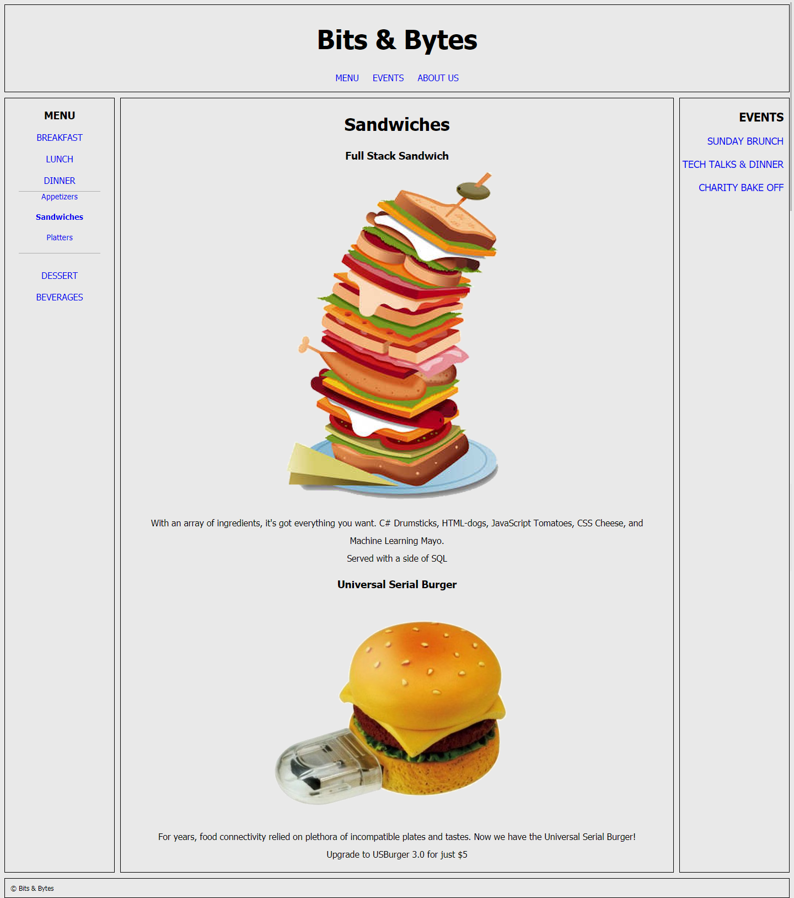

# CSS Grid and Responsive Design

## Overview of session

In this session, you'll build the CSS grid for a restaurant website. The students' starting lecture code contains the HTML markup and two stylesheets: `style.css` for the styling rules and `grid.css` where you'll add the grid rules. You'll create the necessary styles to build a page that looks like this:

You'll also use media query rules to define a "mobile view":

## Session objectives

- Lay out an HTML5 page using CSS Grid
- Define a grid container using rows and columns
- Define named grid template areas
- Assign page elements to grid template areas for purposes of page layout
- Create a page with multiple layouts depending on screen width
- Use media queries (screen width) to define different dimensions for grid containers
- Use the relevant dev tools available in Chrome or Firefox to assist with developing grid layouts

## References

- [A Complete Guide to Grid](https://css-tricks.com/snippets/css/complete-guide-grid/)
- [Grid Garden](http://cssgridgarden.com/)
- [Holy Grail Layout](https://alligator.io/css/css-grid-holy-grail-layout/)
