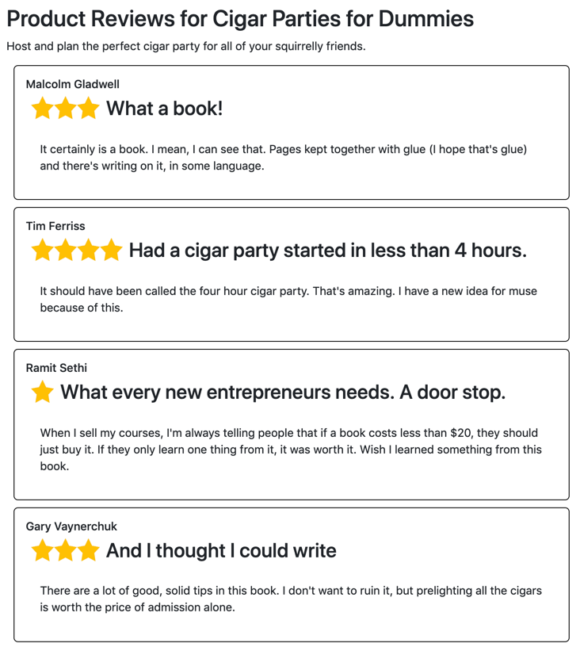

# Code Walkthrough

You will building out an application that lists out product reviews for our book, Cigar Parties for Dummies. When you are done with this application it should look like this.



## Code

The starting code is located in the `product-reviews` folder. All of your changes will happen in `app.js`. Your goal is to complete the functions in `app.js`

### Hint

Each review follows this structure:

```html
<div class="review">
    <h4></h4>
    <div class="rating">
        
    </div>
    <h3></h3>
    <p></p>
</div>
```
