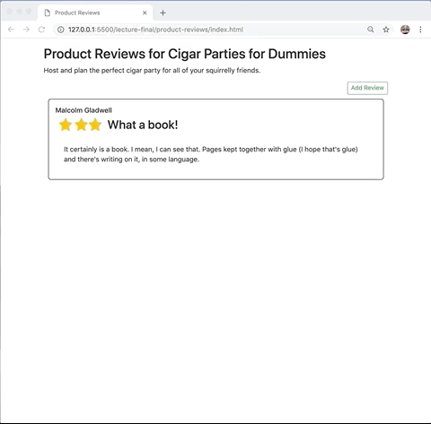

# 08_Event_Handling

# Code Walkthrough
You need to provide functionality as in the picture below:

## Code

The starting code is located in the `product-reviews` folder. All of your changes will happen in `app.js`. Your goal is to complete the functions in `app.js`

## References

- [MDN UIEvent Documentation](https://developer.mozilla.org/en-US/docs/Web/API/UIEvent)
- [MDN Event Handling Documentation](https://developer.mozilla.org/en-US/docs/Learn/JavaScript/Building_blocks/Events)
